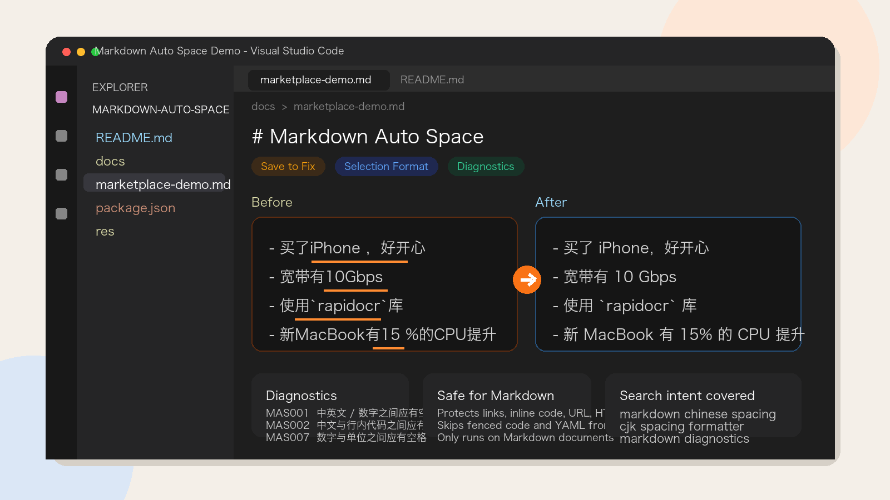

<p align="center">
  
</p>

# Markdown Auto Space

Format Chinese-English spacing in Markdown for VS Code.

> 保存时自动修正 Markdown 中的中英混排空格，支持格式化整篇 / 选区，并用波浪线提示不符合规则的位置。

[VS Code Marketplace](https://marketplace.visualstudio.com/items?itemName=SWHL.markdown-auto-space)



## Why install it

如果你经常写中文技术文档、README、博客或知识库，Markdown 里最容易反复手改的就是这些细节：

- `中文English` -> `中文 English`
- ``使用`rapidocr`库`` -> ``使用 `rapidocr` 库``
- `网速10Gbps` -> `网速 10 Gbps`
- `15 %的提升` -> `15% 的提升`
- `买了iPhone ，好开心` -> `买了 iPhone，好开心`

这个扩展把这些排版修正放进 VS Code 的日常编辑流里，不需要再手动全局替换。

## What it does

- 只处理 **Markdown** 文件，不会误改代码文件
- 支持 **手动保存时自动修正**
- 支持 **Format Document / 选区格式化**
- 支持 **诊断提示（squiggles）**，像 markdownlint 一样直接标出问题位置
- 支持 **9 条可单独开关的规则（MAS001–MAS009）**
- 支持 **VS Code Desktop** 和 **VS Code for the Web**（`vscode.dev`、`github.dev`）

## Rules covered

扩展当前覆盖的规则包括：

| 方向 | 规则码 | 示例 |
|------|--------|------|
| 中英文 / 数字边界加空格 | MAS001 | `中文English` -> `中文 English` |
| 中文与行内代码之间加空格 | MAS002 | ``使用`rapidocr`库`` -> ``使用 `rapidocr` 库`` |
| 中文与链接 / URL 之间加空格 | MAS003 | `查看[文档](url)` -> `查看 [文档](url)` |
| 英文 / 数字之间的顿号改为逗号加空格 | MAS004 | `Python、Java` -> `Python, Java` |
| 斜杠与中文之间加空格 | MAS005 | `前端/后端` -> `前端 / 后端` |
| 链接文本 `[]` 内中英混排加空格 | MAS006 | `[配置import](url)` -> `[配置 import](url)` |
| 数字与单位之间加空格 | MAS007 | `10Gbps` -> `10 Gbps` |
| 百分号 / 度数与数字之间不留空格 | MAS008 | `15 %` -> `15%` |
| 全形标点旁去掉多余空格 | MAS009 | `iPhone ，好` -> `iPhone，好` |

规则说明、更多示例与配置方式见 [docs/RULES.md](./docs/RULES.md)。

## Safe by default

扩展会保护这些内容，避免格式化时误伤：

- Markdown 链接：`[text](url)`
- 图片：``
- 行内代码：反引号包裹内容
- 独立 URL：`https://...`
- 双引号 / 单引号内容
- HTML 标签
- 围栏代码块、缩进代码块、YAML front matter

也就是说，它针对的是 Markdown 文案排版，不是代码美化器。

## Install

在 VS Code 扩展市场搜索以下任一关键词即可找到：

- `Markdown Auto Space`
- `markdown chinese spacing`
- `markdown cjk spacing`
- `markdown formatter chinese`

或直接安装：

```bash
code --install-extension SWHL.markdown-auto-space
```

## Usage

### 1. Save to fix

默认开启 `markdownAutoSpace.formatOnSave`，你手动保存 Markdown 文件时会自动修正空格问题。

### 2. Format document or selection

- 命令面板运行 `Markdown Auto Space: Format Markdown Spacing / 对当前文档执行中英文加空格`
- 命令面板运行 `Markdown Auto Space: Format Selection / 仅格式化选中行/选区`
- 也可以从编辑器标题栏或右键菜单触发

### 3. See diagnostics before fixing

开启 `markdownAutoSpace.diagnostics.enable` 后，扩展会像 markdownlint 一样用波浪线提示问题，并显示对应规则码：

- `MAS001`: 中英文 / 数字之间应有空格
- `MAS002`: 中文与行内代码之间应有空格
- `MAS003`: 中文与链接 / URL 之间应有空格
- `MAS004`: 英文 / 数字间的顿号应改为逗号加空格
- `MAS005`: 斜杠与中文之间应有空格
- `MAS006`: 超链接 `[]` 内中英文混排时英文左右应有空格
- `MAS007`: 数字与单位之间应有空格
- `MAS008`: 度数、百分号与数字之间不应有空格
- `MAS009`: 全形标点旁不应有空格

## Configuration

| 配置项 | 默认值 | 说明 |
|------|------|------|
| `markdownAutoSpace.diagnostics.enable` | `true` | 显示规则提示波浪线 |
| `markdownAutoSpace.formatOnSave` | `true` | 手动保存 Markdown 时自动修正 |
| `markdownAutoSpace.formatOnDocument` | `false` | 执行 Format Document 时修正 |
| `markdownAutoSpace.rules` | 全部开启 | 按规则码单独开关 MAS001–MAS009 |

例如关闭部分规则：

```json
{
  "markdownAutoSpace.rules": {
    "MAS005": false,
    "MAS009": false
  }
}
```

## Behavior details

- 仅在语言 ID 为 `markdown` 的文件中生效
- 自动保存、失焦保存不会触发 `formatOnSave`
- 未选中内容时，“格式化选中”会处理当前光标所在行
- 无需修改时不会产生空编辑，避免文档脏状态抖动

## Rule docs

更完整的规则说明、输入输出示例和与《中文文案排版指北》的对应关系见 [docs/RULES.md](./docs/RULES.md)。

## Changelog

| 版本 | 摘要 |
|------|------|
| **0.0.8** | 重写 Marketplace 文案与关键词；新增更接近真实 VS Code 的横向宣传图；优化商店展示与 VSIX 体积 |
| **0.0.7** | 优化格式化稳定性与选区处理；新增自动发版工作流；精简 CI 与发布链路 |
| **0.0.6** | 新增 MAS007–MAS009：数字与单位、度 / 百分号、全形标点旁空格规则 |
| 0.0.5 | 新增 MAS006：链接文本 `[]` 内中英混排空格 |

完整历史见 [CHANGELOG.md](./CHANGELOG.md)。

## Development

```bash
pnpm lint
pnpm typecheck
pnpm test
pnpm package:vsix
```

## References

- [中文文案排版指北](https://github.com/sparanoid/chinese-copywriting-guidelines)
- [markdownlint](https://github.com/DavidAnson/markdownlint)
- [autocorrect](https://github.com/huacnlee/autocorrect)
- [vscode-auto-space](https://github.com/Talljack/vscode-auto-space)

## License

[MIT](./LICENSE) © [SWHL](https://github.com/SWHL)
